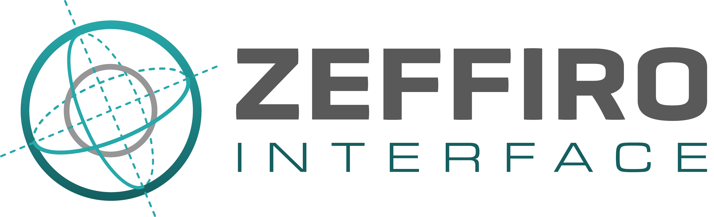

# Zeffiro Interface

© 2018- Sampsa Pursiainen & ZI Development Team

[](https://se.mathworks.com/matlabcentral/fileexchange/68285-zeffiro-forward-and-inverse-interface-for-complex-geometries)



## Introduction

Zeffiro Interface (ZI) is an open source code package constituting an accessible tool for multidisciplinary finite element (FE) based forward and inverse simulations in complex geometries. Developed for MATLAB, ZI aims to streamline the process of analyzing brain activity and make it accessible to researchers and clinicians alike. With ZI, one can generate a volumetric finite element mesh for a realistic multilayer geometry, such as human brain or an asteroid.

A suitable surface segmentation can be produced, for example, using the FreeSurfer software suite (https://surfer.nmr.mgh.harvard.edu) or Brainstorm (https://neuroimage.usc.edu/brainstorm/). ZI allows importing an anatomy to create an FE mesh distinguishing multiple different brain regions and, thereby, analysing cortical and sub-cortical structures as well as connectivity of the brain function over a time series. In each compartment, the orientation of the activity can be either normally constrained or unconstrained. The main routines of ZI can be accelerated significantly in a computer equipped with a graphics computing unit (GPU). It is recommendable to perform the forward simulation process, i.e., to generate the FE mesh, the lead field matrix and to interpolate between different point sets, utilizing a GPU.

## Requirements

- MATLAB >= r2019a
- Toolboxes
    - Signal Processing Toolbox
    - Optimization toolbox
    - Parallel Computing Toolbox
    - Statistics and Machine Learning Toolbox
- GPU (optional)

## Installation

Zeffiro Interface relies on the external repositories, such as SDPT3, SeDuMi and others, that will
be fetched automatically when cloning with `--recurse-submodules`. See the [installation wiki page][installation-wiki]
for instructions on how to install Zeffiro Interface.

[installation-wiki]: https://github.com/sampsapursiainen/zeffiro_interface/wiki/Downloading-and-Setting-Up-Zeffiro

## Getting Started

To start ZI, open Matlab, navigate to the project directory and run the following command:

```matlab
zeffiro_interface()
```

To learn more about startup options, run one of the following commands in Matlab:

```matlab
help zeffiro_interface
% or
doc zeffiro_interface
```

Read the [wiki](/wiki) pages for more information.

[//]: # (Links to video tutorials, example projects, and other learning resources.)

[//]: # (Main Features: An outline of the primary tools and functionalities available in the Zeffiro Interface, with links to more detailed documentation.)

[//]: # (Troubleshooting and Support: Guidance on how to address common issues, report bugs, and seek assistance from the community or developers.)

## Contributing

See [CONTRIBUTING.md](CONTRIBUTING.md) for details on how to contribute to the project.

## License

Zeffiro Interface is licensed under the GNU GPLv3.
See the [LICENSE](LICENSE) file for details.

Submodules from [external](external) directory are licensed as follows:

- CVX: GNU GPLv3
- fieldtrip: GNU GPLv3
- OSQP: Apache v2.0
- SDPT3: GNU GPLv2
- SeDuMi: GNU GPLv2
- SESAME: unknown
- spm12: GNU GPLv2

## Related papers

[//]: # (TODO: Add links to the papers.)

The interface itself has been introduced in:

- He, Q., Rezaei, A. & Pursiainen, S. (2019). Zeffiro User Interface for Electromagnetic Brain
  Imaging: a GPU Accelerated FEM Tool for Forward and Inverse Computations in Matlab.
  Neuroinformatics, https://doi.org/10.1007/s12021-019-09436-9

Recent papers:

- Galaz Prieto, F., Rezaei, A., Samavaki, M., & Pursiainen, S. (2022). L1-norm vs. L2-norm fitting
  in optimizing focal multi-channel tES stimulation: linear and semidefinite programming vs.
  weighted least squares. Computer Methods and Programs in Biomedicine, 226,
  107084, https://doi.org/10.1016/j.cmpb.2022.107084

- Lahtinen, J., Koulouri, A., Rezaei, A., & Pursiainen, S. (2022). Conditionally Exponential Prior
  in Focal Near-and Far-Field EEG Source Localization via Randomized Multiresolution Scanning (
  RAMUS). Journal of Mathematical Imaging and Vision,
  1-22. https://doi.org/10.1007/s10851-022-01081-3

- Rezaei, A., Lahtinen, J., Neugebauer, F., Antonakakis, M., Piastra, M. C., Koulouri, A., Wolters,
  C. H., & Pursiainen, S. (2021). Reconstructing subcortical and cortical somatosensory activity via
  the RAMUS inverse source analysis technique using median nerve SEP data. NeuroImage, 245, 118726.
  https://doi.org/10.1016/j.neuroimage.2021.118726

- Rezaei, A., Koulouri, A., & Pursiainen, S. (2020). Randomized multiresolution scanning in focal
  and fast E/MEG sensing of brain activity with a variable depth. Brain Topography, 33(2),
  161-175. https://doi.org/10.1007/s10548-020-00755-8

The essential mathematical techniques used in the interface have been reviewed and validated in:

- Miinalainen, T., Rezaei, A., Us, D., Nüßing, A., Engwer, C., Wolters, C. H., & Pursiainen, S. (
  2019). A realistic, accurate and fast source modeling approach for the EEG forward problem.
  NeuroImage, 184, 56-67. https://doi.org/10.1016/j.neuroimage.2018.08.054

- Pursiainen, S. (2012). Raviart–Thomas-type sources adapted to applied EEG and MEG: implementation
  and results. Inverse Problems, 28(6), 065013. https://doi.org/10.1088/0266-5611/28/6/065013

The IAS MAP (iterative alternating sequential maximum a posteriori) inversion method and the
hierarchical Bayesian sampler are based on:

- Calvetti, D., Hakula, H., Pursiainen, S., & Somersalo, E. (2009). Conditionally Gaussian
  hypermodels for cerebral source localization. SIAM Journal on Imaging Sciences, 2(3),
  879-909. https://doi.org/10.1137/080723995

It has been applied for a realistic brain geometry, e.g., in:

- Lucka, F., Pursiainen, S., Burger, M., & Wolters, C. H. (2012). Hierarchical Bayesian inference
  for the EEG inverse problem using realistic FE head models: depth localization and source
  separation for focal primary currents. Neuroimage, 61(4),
  1364-1382. https://doi.org/10.1016/j.neuroimage.2012.04.017

The current preserving source model combines linear (face-intersecting) and quadratic (edgewise)
elements via the Position Based Optimization (PBO) method and the 10-source stencil in which 4 face
sources and 6 edge sources are applied for each tetrahedral element containing a source:

- Bauer, M., Pursiainen, S., Vorwerk, J., Köstler, H., & Wolters, C. H. (2015). Comparison study for
  Whitney (Raviart–Thomas)-type source models in finite-element-method-based EEG forward modeling.
  IEEE Transactions on Biomedical Engineering, 62(11),
  2648-2656. https://doi.org/10.1109/TBME.2015.2439282

- Pursiainen, S., Vorwerk, J., & Wolters, C. H. (2016). Electroencephalography (EEG) forward
  modeling via H (div) finite element sources with focal interpolation. Physics in Medicine &
  Biology, 61(24), 8502. https://doi.org/10.1088/0031-9155/61/24/8502

---

Zeffiro Interface is not intended for use in clinical applications. The authors do not assume
responsibility for the results obtained with ZI when using clinical data.
